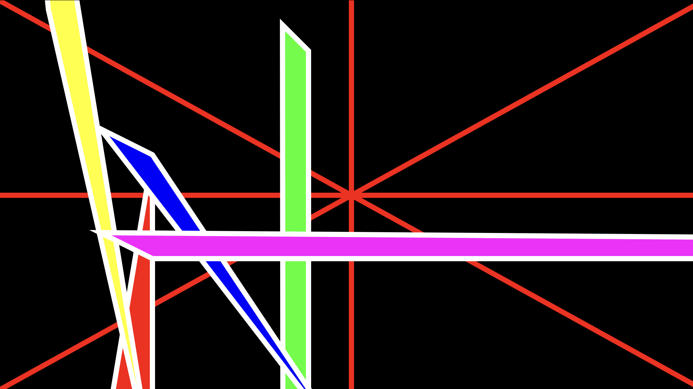

# ⌘ Antony's CART253 website ⌘
//coursework website 

cart 214 collage made by me

## USEFUL PATHS
- [Topics //WORK IN PROGRESS](topics.md)
- [Journal](journal.md)
- [Github Repository](https://github.com/untitledsaint/CART253)

welcome welcome, here you will find any prototypes, projects and experiments that fall under CART 253 taught by [Pippin Barr](https://pippinbarr.com)

# PROTOTYPING: INSTRUCTIONS
## prototype 1

### [//prototype-1](https://untitledsaint.github.io/CART253/Prototyping/INSTRUCTIONS/instructions-prototype-1/)

CODE : https://github.com/untitledsaint/CART253/blob/main/Prototyping/INSTRUCTIONS/instructions-prototype-1/js/script.js

## prototype 2

### [//prototype-2](https://untitledsaint.github.io/CART253/Prototyping/INSTRUCTIONS/instructions-prototype-2/)

CODE :  https://github.com/untitledsaint/CART253/blob/main/Prototyping/INSTRUCTIONS/instructions-prototype-2/js/script.js

## prototype 3

### [//prototype-3](https://untitledsaint.github.io/CART253/Prototyping/INSTRUCTIONS/instructions-prototype-3/)

CODE : https://github.com/untitledsaint/CART253/blob/main/Prototyping/INSTRUCTIONS/instructions-prototype-3/js/script.js

### ✿ enjoy the stay ✿

