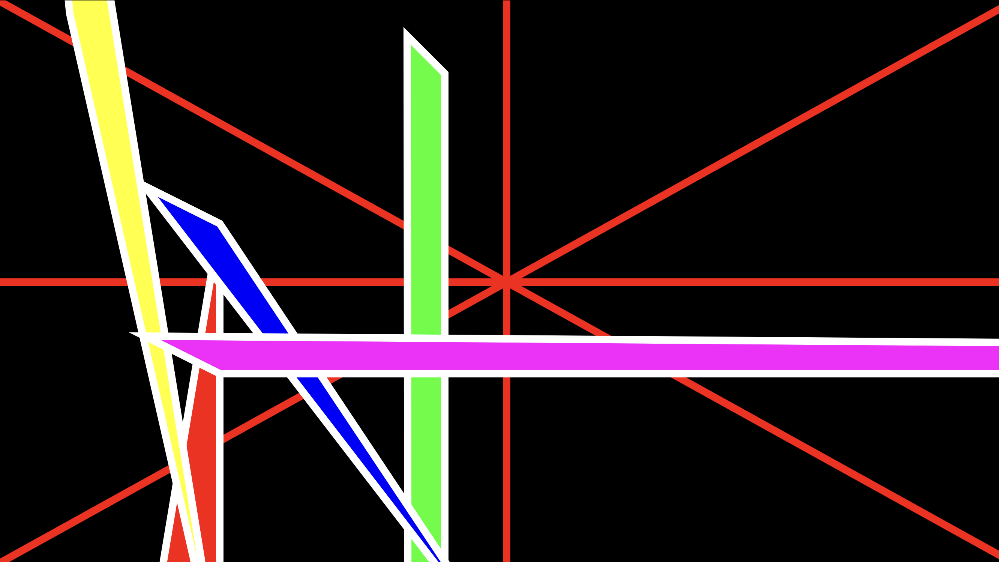
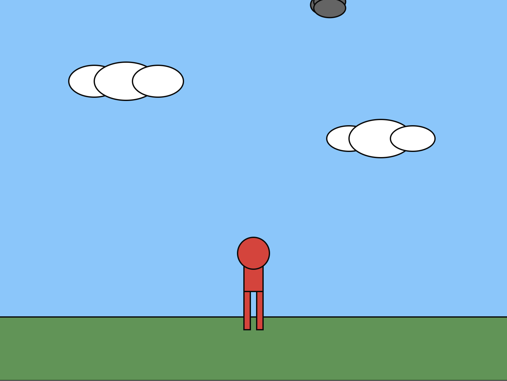
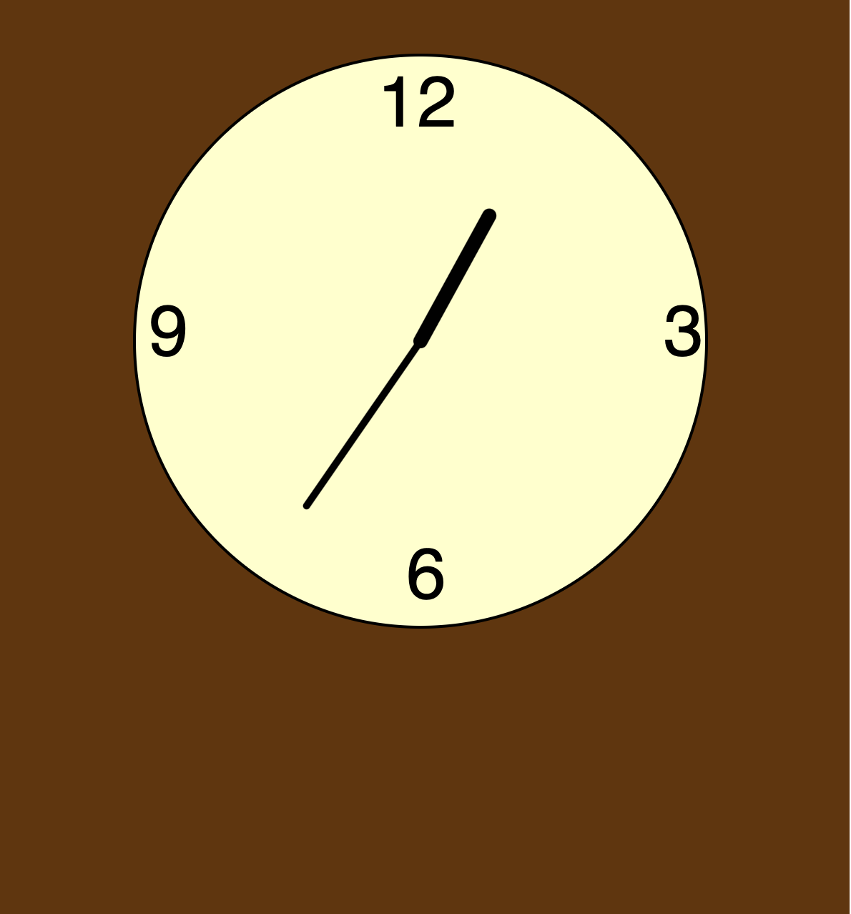
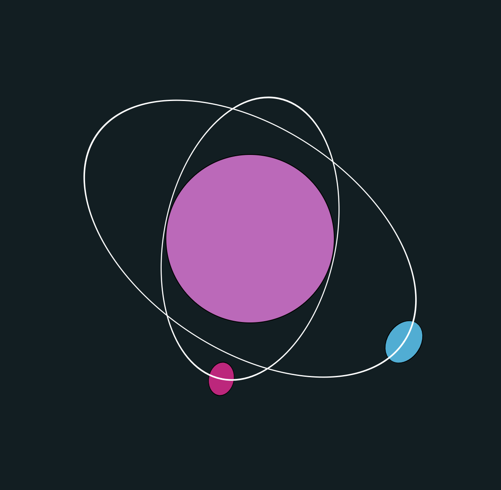
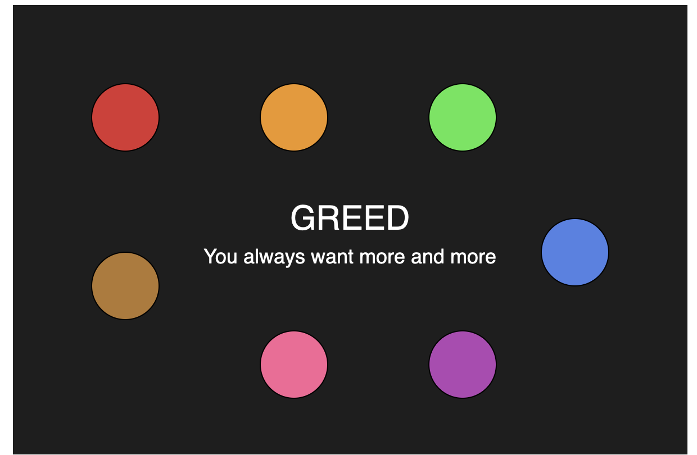

# ⌘ Antony's CART253 website ⌘
//coursework website 

⌘⌘⌘⌘⌘⌘⌘⌘⌘⌘⌘⌘⌘⌘⌘⌘⌘⌘⌘⌘⌘⌘⌘⌘⌘⌘⌘⌘⌘⌘⌘⌘⌘⌘⌘⌘⌘⌘⌘⌘⌘⌘⌘⌘⌘⌘⌘⌘⌘⌘⌘⌘⌘⌘⌘⌘⌘⌘⌘⌘⌘⌘⌘⌘⌘⌘⌘⌘⌘⌘⌘⌘⌘⌘⌘⌘⌘⌘⌘⌘⌘⌘⌘⌘⌘⌘⌘⌘⌘⌘⌘⌘⌘⌘⌘⌘⌘

## USEFUL PATHS
  ### [Journal](journal.md)
- [Github Repository](https://github.com/untitledsaint/CART253)

welcome welcome, here you will find any prototypes, projects and experiments that fall under CART 253 taught by [Pippin Barr](https://pippinbarr.com)

# PROTOTYPING: INSTRUCTIONS
## prototype 1

### [//prototype-1](https://untitledsaint.github.io/CART253/Prototyping/INSTRUCTIONS/instructions-prototype-1/)

[PROTOTYPE 1 CODE](https://github.com/untitledsaint/CART253/blob/main/Prototyping/INSTRUCTIONS/instructions-prototype-1/js/script.js)

## prototype 2

### [//prototype-2](https://untitledsaint.github.io/CART253/Prototyping/INSTRUCTIONS/instructions-prototype-2/)

[PROTOTYPE 2 CODE](https://github.com/untitledsaint/CART253/blob/main/Prototyping/INSTRUCTIONS/instructions-prototype-2/js/script.js)

## prototype 3

### [//prototype-3](https://untitledsaint.github.io/CART253/Prototyping/INSTRUCTIONS/instructions-prototype-3/)

[PROTOTYPE 3 CODE](https://github.com/untitledsaint/CART253/blob/main/Prototyping/INSTRUCTIONS/instructions-prototype-3/js/script.js)

# PROTOTYPING: VARIABLES
## prototype 1

### [//prototype-1](https://untitledsaint.github.io/CART253/Prototyping/VARIABLES/variables-prototype-1/)
[PROTOTYPE 1 CODE](https://github.com/untitledsaint/CART253/tree/main/Prototyping/VARIABLES/variables-prototype-1)
## prototype 2

### [//prototype-2](https://untitledsaint.github.io/CART253/Prototyping/VARIABLES/variables-prototype-2/)
[PROTOTYPE 2 CODE](https://github.com/untitledsaint/CART253/tree/main/Prototyping/VARIABLES/variables-prototype-2)
## prototype 3

### [//prototype-3](https://untitledsaint.github.io/CART253/Prototyping/VARIABLES/variables-prototype-3/)
[PROTOTYPE 3 CODE](https://github.com/untitledsaint/CART253/tree/main/Prototyping/VARIABLES/variables-prototype-3)

# PROTOTYPING: CONDITIONALS
## prototype 1

### [//prototype-1](https://untitledsaint.github.io/CART253/Prototyping/CONDITIONALS/conditionals-prototype-1/)
[PROTOTYPE 1 CODE](https://github.com/untitledsaint/CART253/tree/main/Prototyping/CONDITIONALS/conditionals-prototype-1)
## prototype 2

### [//prototype-2](https://untitledsaint.github.io/CART253/Prototyping/CONDITIONALS/conditionals-prototype-2/)
[PROTOTYPE 2 CODE](https://github.com/untitledsaint/CART253/tree/main/Prototyping/CONDITIONALS/conditionals-prototype-2)
## prototype 3

### [//prototype-3](https://untitledsaint.github.io/CART253/Prototyping/CONDITIONALS/conditionals-prototype-3/)
[PROTOTYPE 3 CODE](https://github.com/untitledsaint/CART253/tree/main/Prototyping/CONDITIONALS/conditionals-prototype-3)

### ✿ enjoy the stay ✿

